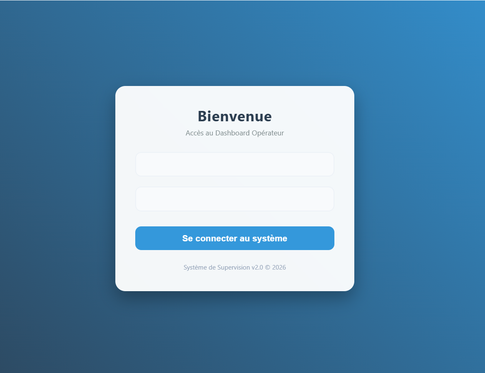
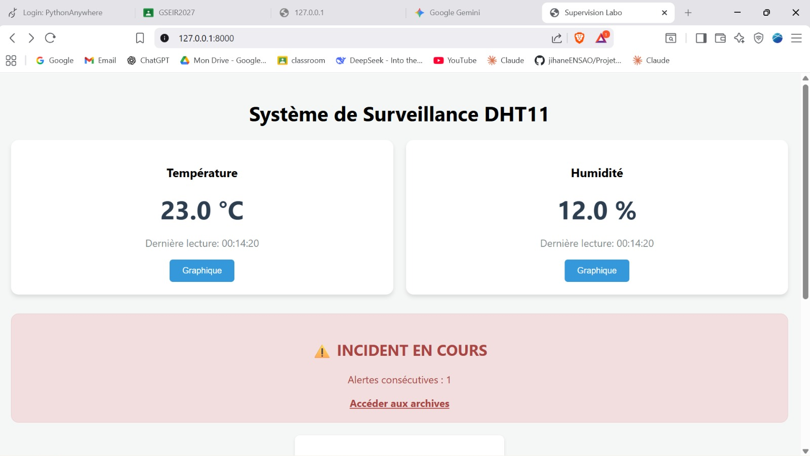
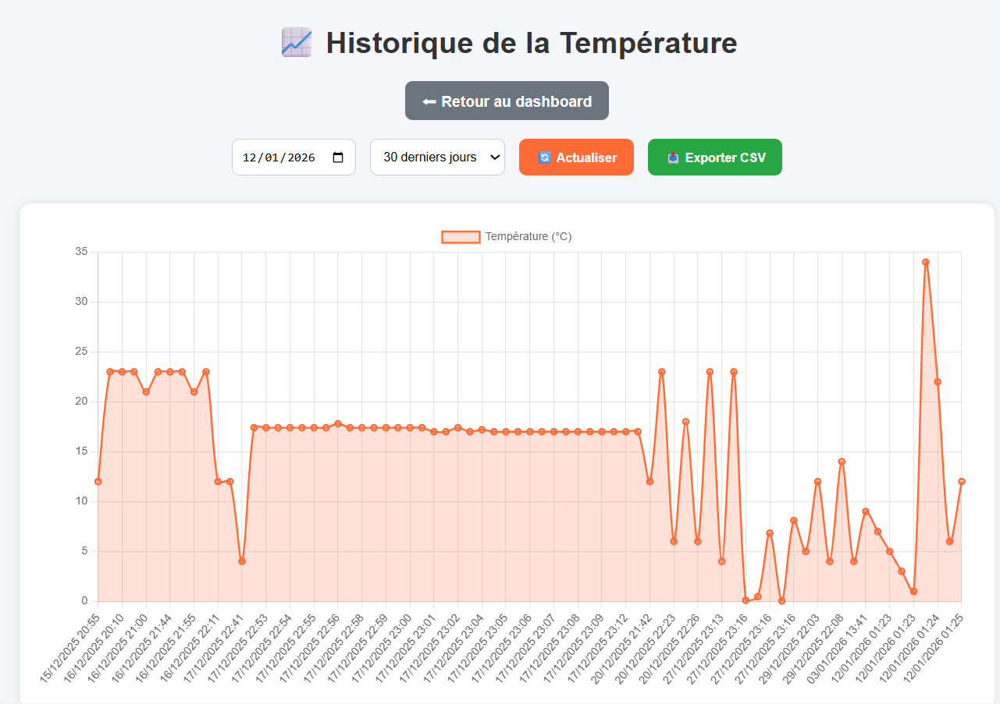
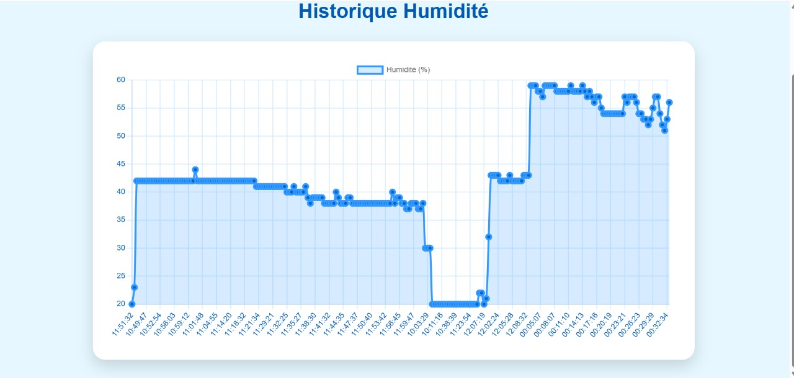
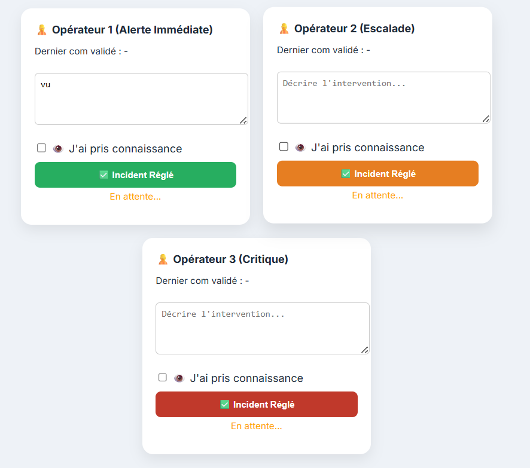
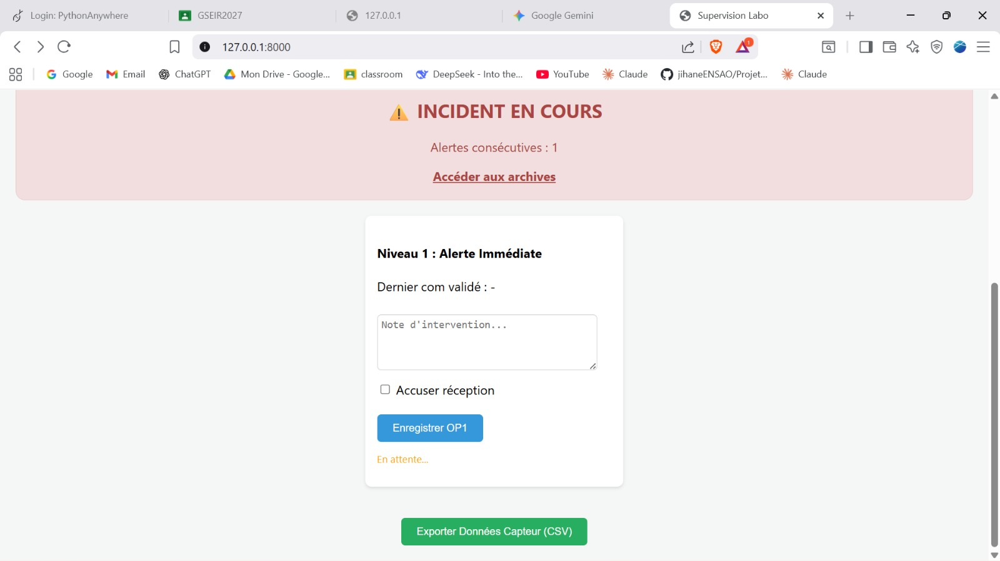
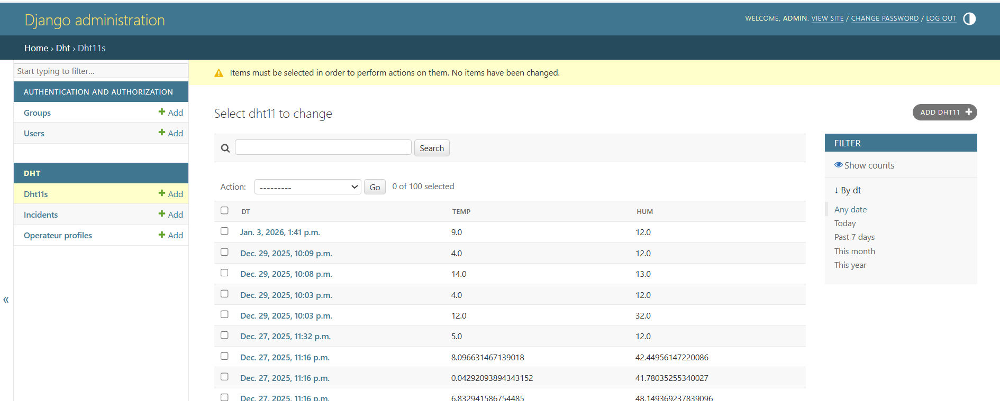
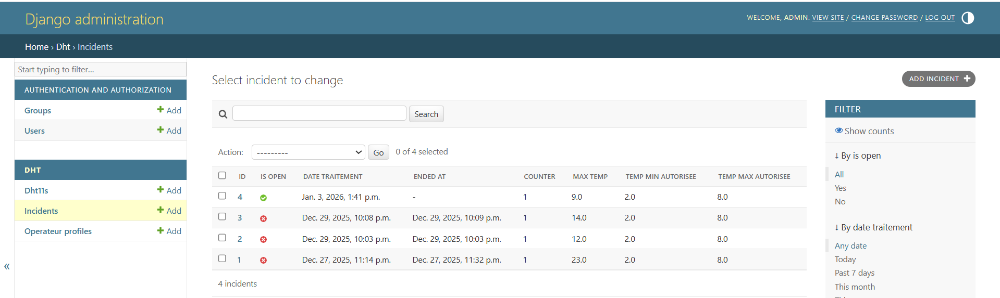
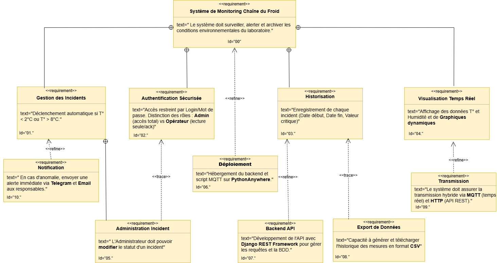
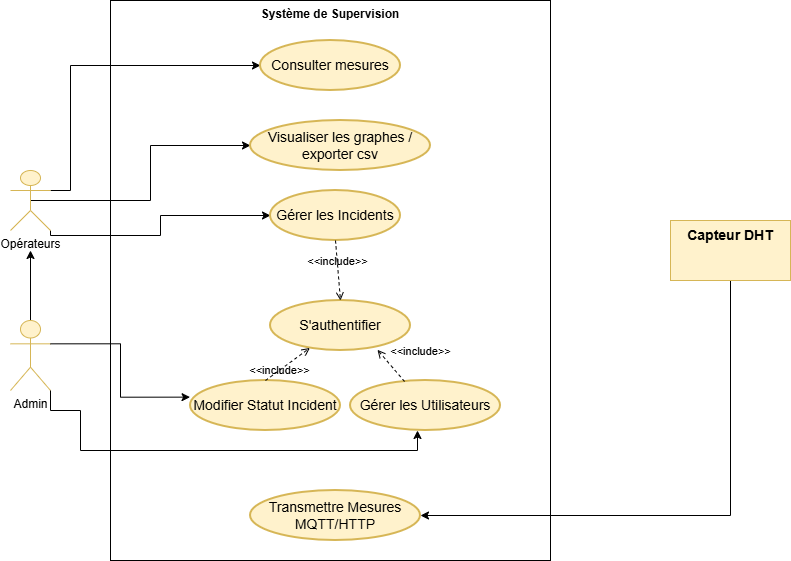

# 🌡️ Système IoT de Surveillance de la Chaîne du Froid


> Système IoT embarqué de surveillance en temps réel de la température et de l'humidité dans un laboratoire d'analyses médicales — avec détection automatique d'anomalies, gestion des incidents multi-niveaux et dashboard web sécurisé.

---

## 📌 Contexte & Problématique

Ce projet a été réalisé dans le cadre d'un **laboratoire d'analyses médicales** disposant de réfrigérateurs contenant des **échantillons biologiques et chimiques** très sensibles aux variations de température.

Ces échantillons nécessitent une conservation stricte entre **2°C et 8°C**. Toute rupture de la chaîne du froid peut :
- ❌ Fausser les résultats d'analyses
- 💸 Entraîner des pertes financières importantes
- ⚠️ Mettre en danger la qualité des soins

La **surveillance manuelle** présente des limites critiques : elle n'est pas continue et dépend de l'humain — que se passe-t-il le week-end ou la nuit ?

**Notre solution** : un système IoT automatisé, disponible 24h/24, capable de détecter et signaler instantanément toute anomalie.

---

## ✨ Fonctionnalités

| Fonctionnalité | Description |
|---|---|
| 📡 **Acquisition en temps réel** | Lecture DHT11 via ESP8266, transmission hybride MQTT + HTTP |
| 🌡️ **Dashboard web** | Visualisation live température & humidité avec graphiques dynamiques |
| 🚨 **Détection d'anomalies** | Alerte automatique si T° < 2°C ou T° > 8°C |
| 📋 **Gestion des incidents multi-niveaux** | 3 niveaux : Alerte Immédiate / Escalade / Critique |
| 🔔 **Notifications** | Alertes automatiques via Telegram et Email |
| 🗃️ **Historique complet** | Traçabilité totale + Export CSV des mesures |
| 🔐 **Accès sécurisé multi-rôles** | Admin (accès total) vs Opérateurs (lecture/ack) |
| ☁️ **Déploiement cloud** | Backend hébergé sur PythonAnywhere |

---

## 🖥️ Démonstration

### Page de connexion sécurisée


### Dashboard principal — Surveillance en temps réel


### Historique de la Température


### Historique de l'Humidité


### Gestion des incidents — Interface opérateurs


### Interface d'alerte active


### Administration Django — Mesures DHT11


### Administration Django — Suivi des incidents


---

## 📐 Conception SysML

### Diagramme d'Exigences


### Diagramme de Cas d'Utilisation


---

## 🏗️ Architecture du système

```
┌─────────────────────────────────────────────────────────────────┐
│                        COUCHE MATÉRIELLE                        │
│                                                                 │
│   [Capteur DHT11]  ──►  [ESP8266 NodeMCU]                      │
│   Temp + Humidité         C++ / Arduino                         │
└──────────────────────────────┬──────────────────────────────────┘
                               │  MQTT Publish / HTTP POST
                               ▼
┌─────────────────────────────────────────────────────────────────┐
│                      COUCHE COMMUNICATION                       │
│                                                                 │
│            [Broker MQTT]  ◄──►  [API REST Django]              │
│           Transmission temps réel    Django REST Framework      │
└──────────────────────────────┬──────────────────────────────────┘
                               │
                               ▼
┌─────────────────────────────────────────────────────────────────┐
│                        COUCHE BACKEND                           │
│                                                                 │
│   [Django Backend — PythonAnywhere]                             │
│   ┌──────────────┐  ┌──────────────────┐  ┌─────────────────┐  │
│   │  Table DHT11 │  │ Table Incidents  │  │Operateur Profiles│  │
│   │ Temp/Hum/Date│  │Statut/Niveaux    │  │ Roles & Accès   │  │
│   └──────────────┘  └──────────────────┘  └─────────────────┘  │
│                      SQLite Database                             │
└──────────────────────────────┬──────────────────────────────────┘
                               │  API REST GET
                               ▼
┌─────────────────────────────────────────────────────────────────┐
│                      COUCHE PRÉSENTATION                        │
│                                                                 │
│   [Dashboard Web]  ──  [Graphiques]  ──  [Gestion Incidents]   │
│   HTML/CSS/JS          Temps réel        Multi-niveaux          │
│                                                                 │
│   [Notifications]  ──  [Export CSV]                            │
│   Telegram + Email     Historique complet                       │
└─────────────────────────────────────────────────────────────────┘
```

---

## 🗃️ Structure des données

### Table `DHT11` — Mesures
| Champ | Type | Description |
|-------|------|-------------|
| `dt` | DateTime | Horodatage de la mesure |
| `temp` | Float | Température mesurée (°C) |
| `hum` | Float | Humidité relative (%) |

### Table `Incidents`
| Champ | Type | Description |
|-------|------|-------------|
| `is_open` | Boolean | Incident ouvert ou résolu |
| `date_traitement` | DateTime | Date de début de l'incident |
| `ended_at` | DateTime | Date de clôture |
| `counter` | Integer | Nombre d'alertes consécutives |
| `max_temp` | Float | Valeur maximale mesurée |
| `temp_min_autorisee` | Float | Seuil minimum (2°C) |
| `temp_max_autorisee` | Float | Seuil maximum (8°C) |

> 🚨 Un incident est créé automatiquement si T° < 2°C ou T° > 8°C, avec 3 niveaux d'escalade

---

## 🗂️ Structure du projet

```
📦 cold-chain-iot/
├── 📁 Code/              # Code embarqué ESP8266 (C++ / Arduino)
│   └── main.ino          # Lecture DHT → JSON → MQTT/HTTP
├── 📁 DHT/               # App Django : modèle & API mesures DHT11
├── 📁 incident/          # App Django : détection & gestion incidents
├── 📁 projet/            # Configuration principale Django
├── 📁 static/js/         # Scripts JavaScript (graphiques temps réel)
├── 📁 templates/         # Templates HTML (dashboard, login, alertes)
├── 📁 assets/            # Captures d'écran & diagrammes (README)
├── 📄 manage.py          # Point d'entrée Django
├── 📄 requirements.txt   # Dépendances Python
└── 📄 db.sqlite3         # Base de données SQLite
```

---

## 🔧 Technologies utilisées

### Hardware
- **ESP8266** (NodeMCU) — microcontrôleur WiFi
- **Capteur DHT11** — température & humidité

### Protocoles
- **MQTT** — transmission temps réel légère
- **HTTP / API REST** — Django REST Framework

### Software
- **C++ (Arduino Framework)** — programmation ESP8266
- **Python 3.x + Django** — backend & API REST
- **SQLite** — base de données
- **HTML / CSS / JavaScript** — interface web

### Déploiement
- **PythonAnywhere** — hébergement cloud du backend

### Conception
- **SysML** — Diagramme d'exigences + Use Case (draw.io)

---

## 🚀 Installation & Lancement

### Prérequis
- Python 3.x installé
- Arduino IDE (pour flasher l'ESP8266)
- Broker MQTT (Mosquitto local ou cloud)

### 1. Cloner le dépôt
```bash
git clone https://github.com/TON-COMPTE/cold-chain-iot.git
cd cold-chain-iot
```

### 2. Installer les dépendances
```bash
pip install -r requirements.txt
```

### 3. Appliquer les migrations
```bash
python manage.py migrate
```

### 4. Lancer le serveur
```bash
python manage.py runserver
```

### 5. Flasher l'ESP8266
- Ouvre `Code/main.ino` avec Arduino IDE
- Configure l'IP du broker MQTT et du serveur
- Téléverse sur l'ESP8266

### 6. Accéder au dashboard
```
http://127.0.0.1:8000
```

---

## 🎓 Contexte académique

| | |
|---|---|
| **Établissement** | École Nationale des Sciences Appliquées d'Oujda (ENSAO) |
| **Filière** | GSEIR-4 (Génie des Systèmes Électroniques, Informatiques et Réseaux) |
| **Encadrant** | Mr. Moussati Ali |
| **Année** | 2024 – 2025 |

---

## 👩‍💻 Auteures

**Jihane Bouras**
🔗 [LinkedIn](https://linkedin.com/in/jihane-bouras-74896427a) • 📧 jihane.brs123@gmail.com

**El Azimani Chaimae**

---

## 🔮 Perspectives d'évolution

- 📲 Alertes par **SMS**
- 📱 **Application mobile**
- 🔋 **Batterie de secours** pour continuité en cas de coupure
- 🌡️ **Multi-capteurs** pour surveillance de plusieurs réfrigérateurs

---

## 📄 Licence

Ce projet est réalisé dans un cadre académique — ENSAO 2024/2025.
